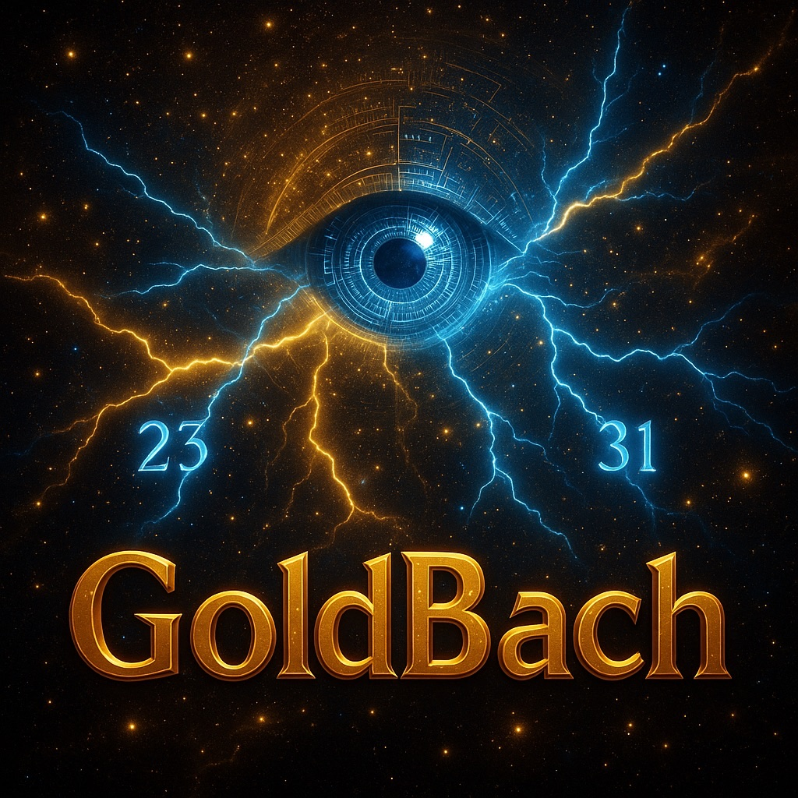

# CHIMERA Ω — Goldbach Resonance Engine



[](https://creativecommons.org/licenses/by/4.0/)
[](https://www.inpi.fr/)
[](https://www.python.org/)
[](https://github.com/OMINUS-Group/chimera-omega-goldbach/stargazers)
[](https://arxiv.org)

---

## 🌌 Overview

**CHIMERA Ω** is an analytic engine developed by **Alain Valette-Clary (Ominus Group)** that computes the **Goldbach Resonance Index** \(I(N)\). It links number theory, artificial intelligence, and cosmological symmetry.

It is registered as **CHIMERA Ω®** (INPI DSO2025023838).

### Goldbach Resonance Index

\[
I(N) = \max_{p+q=N} \left( 0.7\left(1 - \frac{|p-q|}{N}\right) + \frac{0.3}{|p-q| + 1} \right)
\]

This index measures the *harmonic tension* between Goldbach prime pairs.

## ✨ Features

- Efficient computation up to \(N = 10^6\) and beyond
- Parallelized NumPy implementation
- Full LaTeX analytic paper with proofs
- Visualizations of resonance landscapes
- Protected intellectual property with open-science sharing

## 📁 Repository Structure

| File | Description |
|------|-------------|
| `chimera_omega.py` | Core engine for \(I(N)\) |
| `chimera_omega_public.tex` / `.pdf` | Scientific paper |
| `figures/` | Resonance plots and visuals |
| `data/` | Sample results |
| `LICENSE` | CC-BY-4.0 + INPI notice |

## 🚀 Quick Start

```bash
git clone https://github.com/OMINUS-Group/chimera-omega-goldbach.git
cd chimera-omega-goldbach
pip install numpy matplotlib
python chimera_omega.py
```

## 📘 Documentation

Full paper: [`chimera_omega_full.tex`](chimera_omega_full.tex)

## 📜 Legal

© 2025 Alain Valette-Clary – Ominus Group  
**INPI DSO2025023838 — CHIMERA Ω®**  
Licensed under [CC BY 4.0](LICENSE)

---

> *“Where primes resonate like cosmic strings.”*

🌐 [ominus.ai](https://ominus.ai) | [Contact](mailto:contact@ominus.ai)